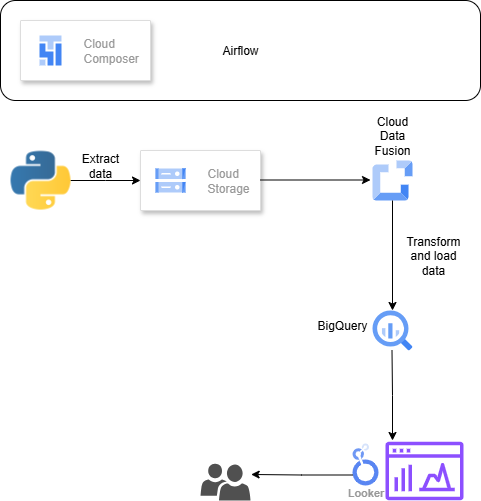
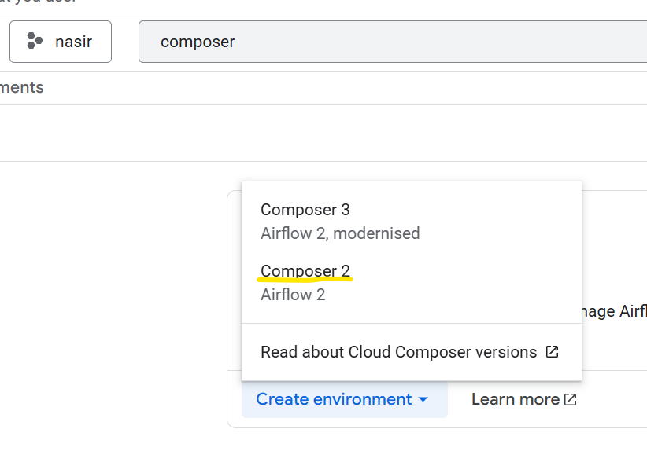
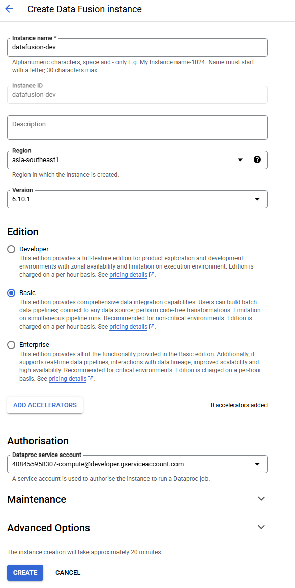

# ETL Data Pipeline on Google Cloud with Cloud Data Fusion & Airflow
Source https://www.youtube.com/watch?v=lMaZnZldxcE&list=PLLrA_pU9-Gz2DaQDcY5g9aYczmipBQ_Ek

Creating a data pipeline to extract employee data from various sources, mask sensitive information within the data, and load it into BigQuery. Additionally, you are required to develop a dashboard to visualize the employee data securely.
Requirements:
- Data Extraction : Extract employee data from multiple sources such as databases, csv files or APIs.
- Data masking: Identify sensitive information within the employee data such as social security numbers, salary etails, and personal contact information
- Data Loading into BigQuery: Design a process to securely redacted and masked employee data into Google BigQuery.
- Dashboard Visualization: Develop a web-based dashboard using visualization tools (e.g, Google Data Studio, tableau)

Diagram : https://app.diagrams.net/?src=about#G1rQX0eYRMMgAy684C-CJYtiA9HP5MfHIl#%7B%22pageId%22%3A%22ZXkrpQSN2tBN8oPkyrdC%22%7D

### 1. Create Composer Environment
Create composer environment, choose composer 2

### 2. Create Data Fusion Instance

